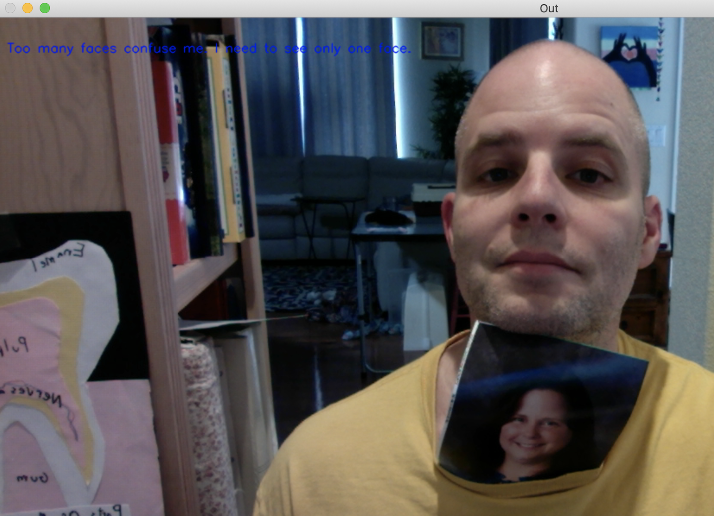

# Computer Pointer Controller

This is the third project for the Udacity course Intel® Edge AI for IoT Developers. The purpose of this project is to use multiple deep learning models to move a mouse cursor on a screen using eye and head pose from a webcam or video.

When the program starts, a window showing the input video appears in the middle of the screen and the mouse pointer is automatically moved to the center of the screen also. As the person in the video moves their eyes and head, the mouse cursor will move in the same direction. Only one person must be in the frame for the mouse cursor to move.

The mouse controller is hardcoded for fast, high-precision movement but you will still see it moving very slowly.

The video and detections from model outputs are shown by default but they can be turned off using command line arguments.


## Project Set Up and Installation
The program works on Linux, MacOS, and Windows. The instructions below are written for Linux 

### Prerequisites
* Intel® OpenVINO™ Toolkit 2019.R3 or above
* pandas
* numpy
* cv2 (comes with OpenVINO)
* pyautogui
* glob
* math


### Setup
```
#Clone this git into your working directory.
$ git clone https://github.com/jlgarcia75/move-mouse-pointer.git```

# Install prerequisites
$ python -m pip install prerequisites.txt```
$ cd move-mouse-pointer/src
$ python main.py -i ../bin/demo.mp4
```
### Directory structure
```
<download dir>
  src/<source files>
  bin/demo.mp4 <video file>
  models/intel/<model name>/<precision>/<modelname .bin and .xml>
  ```
  ## Demo
  Several scripts for both Linux/MacOS (.sh files) and Windows (.bat files) are provided that will run the project with common configurations.

  Take a look at
  ```
  rundemo.sh
  runcam.sh
  ```
  and their equivalent files for Windows with ```.bat``` extensions.

  The only required argument is the ```-i``` argument to specify the input. All other arguments are optional and have default values. For an easy run with an input video:

  ```
  $ source /opt/intel/openvino/bin/setupvars.sh
  $ cd src
  $ python main.py -i ../bin/demo.mp4
  ```

  This will run the program on  for 100 frames. To run the whole video, specify ```-nf 600``` or higher.

  To run the camera with webcam input:
  ```$ python main.py -i 0```

### Model Inputs
When specifying the model directories with the -flm, -hpm, and -gem flags you must provide a directory path that ends with the model name just above the <precision>. When you specify the precision you want to load using the -p flag, the precision will be concatenated to the model path to get to the model files.

For example, the arguments ```-flm ../models/intel/landmarks-regression-retail-0009 -p FP32 ``` will get the .bin and .xml model files from ```../models/intel/landmarks-regression-retail-0009/FP32/landmarks-regression-retail-0009.bin and .xml```

The only exception is the Face Detection model, face-detection-adas-binary-0001. This model is only available in format FP32-INT1, which is different than the other models. This is the only model for which you have to specify the path including the precision and model name:

```-fdm ..\models\intel\face-detection-adas-binary-0001\FP32-INT1\face-detection-adas-binary-0001```

This repository provides the necessary models but if you want to download the models yourself you can do so with:

```
Face Detection
/opt/intel/openvino/deployment_tools/tools/model_downloader/downloader.py --name face-detection-adas-binary-0001 -o ./models/

Head Pose Estimation
/opt/intel/openvino/deployment_tools/tools/model_downloader/downloader.py --name head-pose-estimation-adas-0001 -o ./models/

Facial Landmarks Detection
/opt/intel/openvino/deployment_tools/tools/model_downloader/downloader.py --name landmarks-regression-retail-0009 -o ./models/

Gaze Estimation
/opt/intel/openvino/deployment_tools/tools/model_downloader/downloader.py --name gaze-estimation-adas-0002 -o ./models/
```

## Documentation
The program has many command line arguments that allow you to customize how it runs.

```
usage: main.py [-h] -i INPUT [-p PRECISIONS] [-fdm FD_MODEL] [-flm FL_MODEL]
               [-hpm HP_MODEL] [-gem GE_MODEL] [-l CPU_EXTENSION] [-d DEVICE]
               [-ct CONF_THRESHOLD] [-bm BENCHMARK] [-nf NUM_FRAMES]
               [-sv SHOWVIDEO] [-async ASYNC_INFERENCE]

optional arguments:
  -h, --help            show this help message and exit
  -i INPUT, --input INPUT
                        Path to input image or video file. 0 for webcam.
  -p PRECISIONS, --precisions PRECISIONS
                        Set model precisions as a comma-separated list without
                        spaces, e.g. FP32,FP16,FP32-INT8 (FP16 by default)
  -fdm FD_MODEL, --fd_model FD_MODEL
                        Path to directory for a trained Face Detection
                        model. This directory path must include the model's
                        precision becauseface-detection-adas-binary-0001 has
                        only one precision, FP32-INT1.(../models/intel/face-
                        detection-adas-binary-0001/FP32-INT1/face-detection-
                        adas-binary-0001 by default)
  -flm FL_MODEL, --fl_model FL_MODEL
                        Path to directory for a trained Facial Landmarks
                        model. The directory must have the model precisions as
                        subdirectories.../models/intel/landmarks-regression-
                        retail-0009 by default)
  -hpm HP_MODEL, --hp_model HP_MODEL
                        Path to directory for a trained Head Pose model. The
                        directory must have the model precisions as
                        subdirectories.(../models/intel/head-pose-estimation-
                        adas-0001 by default)
  -gem GE_MODEL, --ge_model GE_MODEL
                        Path to directory for a trained Gaze Detection
                        model. The directory must have the model precisions as
                        subdirectories.(../models/intel/gaze-estimation-
                        adas-0002 by default)
  -l CPU_EXTENSION, --cpu_extension CPU_EXTENSION
                        MKLDNN (CPU)-targeted custom layers. Absolute path to a
                        shared library with thekernels impl.
  -d DEVICE, --device DEVICE
                        Specify the target device to infer on: CPU, GPU, FPGA
                        or MYRIAD is acceptable. The program will look for a
                        suitable plugin for the device specified (CPU by
                        default)
  -ct CONF_THRESHOLD, --conf_threshold CONF_THRESHOLD
                        Confidence threshold for detections filtering (0.3 by
                        default)
  -bm BENCHMARK, --benchmark BENCHMARK
                        Show benchmark data? True|False (True by default)
  -nf NUM_FRAMES, --num_frames NUM_FRAMES
                        The number of frames to run. Use this to limit running
                        time, especially if using webcam. (100 by default)
  -sv SHOWVIDEO, --showvideo SHOWVIDEO
                        Show video while running? True|False. (True by
                        default)
  -async ASYNC_INFERENCE, --async_inference ASYNC_INFERENCE
                        If True, run asynchronous inference where possible. If
                        false, run synchronous inference. True|False. (True by
                        default)
   -v VISUALIZE, --visualize VISUALIZE
                        If True, visualize the outputs from each model. If -v
                        is True then the video will be shown regardless of
                        -sv. If false, do not show outputs. True|False. (True
                        by default)
```
## Benchmarks
Please see  for detailed benchmark data.

The script that runs the benchmarks on Windows is .


## Results

### System Information
- Processor	Intel(R) Core(TM) i5-8350U CPU @ 1.70GHz, 1896 Mhz, 4 Core(s), 8 Logical Processor(s)
- System Model	HP EliteBook 850 G5
- Windows 10 Enterprise Version	10.0.17763 Build 17763
- Installed Physical Memory (RAM)	16.0 GB
- Intel(R) UHD Graphics 620

### Configurations
Performance metrics were gathered across 12 separate runs of the program. The configurations were:

Device  | Inference Type  |  Precision
--|---|--
CPU  | Asynchronous|  FP32
CPU  | Synchronous |  FP32
CPU  | Asynchronous| FP16
CPU  | Synchronous |  FP16
CPU  | Asynchronous| FP32-INT8
CPU  | Synchronous |  FP32-INT8
HETERO:GPU,CPU  |Asynchronous| FP32
HETERO:GPU,CPU  |Synchronous | FP32
HETERO:GPU,CPU  |Asynchronous| FP16
HETERO:GPU,CPU  |Synchronous | FP16
HETERO:GPU,CPU  |Asynchronous| FP32-INT8
HETERO:GPU,CPU  |Synchronous | FP32-INT8

Each run was done on the first 100 frames of the video .

### Metrics
The performance metrics are:
- Total runtime
- Total FPS
Duration for each phase of model execution: load model, pre-process input, infer, get outputs

And the winners are...

The configuration with the shortest total runtime for 100 frames is:

*CPU - Synchronous Inference - FP32* with a total runtime of 140.54 seconds and .71 FPS.

However, there was not a signifant difference in total runtimes because the runtime was dominated by the mouse movement function call.

The shortest inference times per model were:
- Face Detection: 12.54ms/frame with CPU, Synchronous, FP16
- Landmark Detection: .59ms/frame with CPU, Synchronous, FP16
- Head Pose: 1.03ms/frame with CPU,Synchronous, FP32-INT8
- Gaze Estimation: 1.09ms/frame with CPU, Synchronous, FP32-INT8

### GPU vs CPU
The inference times on GPU were always at least 50% slower than on CPU.

The model load times on GPU were 10X slower than on CPU.


### Asynchronous vs. Synchronous Inferencing
Asynchronous inferencing makes sense when unrelated tasks can be done in parallel. For example, an asynchronous inference can be started for two models who work on data indepedently and don't depend on each other's outputs. While there are many opportunities for parallelism in this program, I chose the simplest one and most obvious one.

The Landmark Detection and Head Pose Estimation phases are independent from each other but both depend on the output from the previous phase, Face Detection. The two outputs from Landmark and Head are sent to Gaze Estimation, which is the last phase in the pipeline. For this reason, I chose to run Landmark Detection and Head Pose Estimation with asynchronous inferencing.

Truely asynchronous inferencing is done by running an unrelated task right after the inference is started, as follows:
1. Start async inference job
2. Do unrelated tasks
3. When the result from an async job is needed, call blocking function Wait() to wait for the results to be available. This is the point where processing cannot proceed without the results from the async inference job. A callback function can also be set that gets called when the inference task is finished. In my code, I used the wait() function instead of the callback.

Due to the indeterminate length of unrelated tasks in Step 2 above, it does not make sense to measure the time between when the asynchronous job begins and when the results are gathered. The asynchronous results could be available any time while the unrelated tasks are running and this time is not captured. For this reason, you will find that in the ASYNC INFER tests the inference time for Landmarks and Head Pose is zero, since it was not measured.

If done right by taking advantage of parallelism, asynchronous inferencing can perform better than synchronous inferencing.

In the ASYNC INFER tests, the models were configured as such:
- Facial Detection - Synchronous inference. Reasoning: No job could be run in parallel. Next phase in pipeline could not start until facial detection was completed.
- Landmark Detection - Asynchronous inference. Reasoning: Inference can run in parallel with Head Pose.
- Head Pose - Asynchronous inference. Reasoning: Inference can run in parallel with Landmark Detection.
- Gaze Estimation - Synchronous Inference. Reasoning: No job could be run in parallel. Mouse mover depends on the output.

In the SYNC INFER tests, all models were run with synchronous inferencing so all models had their inference times measured.

### Available Model Precisions
- Face Detection: FP32-INT1
- Landmark Detection: FP32, FP16, FP32-INT8
- Head Pose: FP32, FP16, FP32-INT8
- Gaze Estimation: FP32, FP16, FP32-INT8

 Since the only available precision for Face Detection is FP32-INT1, this precision was used for all runs. In the results, you will see FP32, FP16, and FP32-INT8 next to Face Detection but don't be confused, these were all run with the same model at FP32-INT1.

### FP32 vs FP16
One would think that the load times of the FP32 models would be much slower than the load times for the FP16 but the data shows the opposite is true for my tests on CPU. For example,
```
Landmark Detection load time for FP32 on CPU: 112.46ms
Landmark Detection load time for FP16 on CPU: 137.33ms
```

However, on GPU,CPU, the behavior is as we expect but not by much
```
Landmark Detection load time for FP32 on GPU,CPU: 3620.16ms
Landmark Detection load time for FP16 on GPU,CPU: 3302.29ms
```

## Stand Out Suggestions
### Async Inference
If you have used Async Inference in your code, benchmark the results and explain its effects on power and performance of your project.

### Edge Cases
#### Number of faces detections
The program works only when a single face is detected in the input. When more than one face is detected, a message shows in the video, and on the terminal.

* One face: "I see you. Move the mouse cursor with your eyes." *Run inference*
* More than one face: "Too many faces confuse me. I need to see only one face." *Do not run inference*
* No faces: "Is there anybody out there." *Do not run inference*

Here is a sample picture with two faces. Notice the text message at the top left of the frame.



#### Cool Features
The program has several cool controls from the command line.
* Use the `-nf num_frames` to control the number of frames to process from both video and camera inputs. Example, `-nf 100` runs the program for 100 frames, then exits.
* Use `-p <list of precisions>` to specify several precisions to execute sequentially within the same run. The input video starts at frame 0 at the beginning of a new precision run. Try it yourself with `-p FP32,FP16`.
* Use `-sv False` to not show the video during the run. This way, you will see the mouse moving on the screen without seeing the video itself.
* Use `-v True`, which is default, to view cool model outputs. This will show you face detection, landmarks, head pose, and gaze.

* Use `-bm True` to display performance data. True is default. Use `-bm False` if you don't want to see the peformance data.
* Use `-async True|False` to run the Landmark and Head Pose models with or without asynchronous inferencing.
* Use `-i INPUT` to specify either a video file, an image, your webcam with `-i 0`, or a directory of images by specifying the directory name.

# Attributions
The code to draw the head pose and gaze axes come from an answer in this  by
